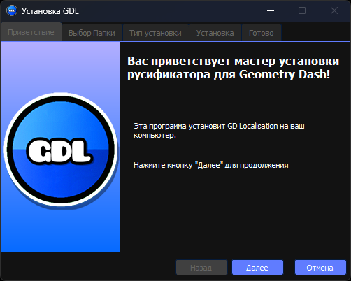
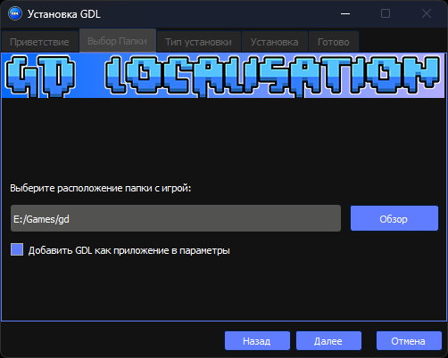
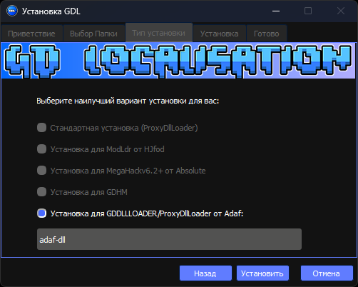
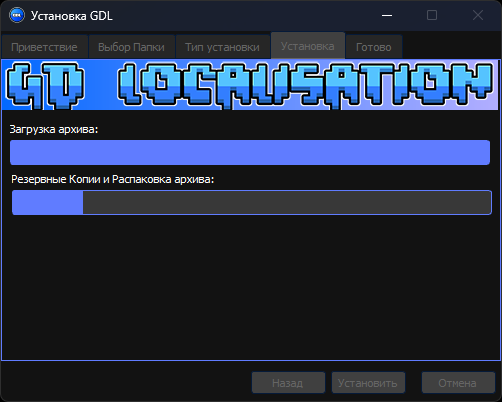
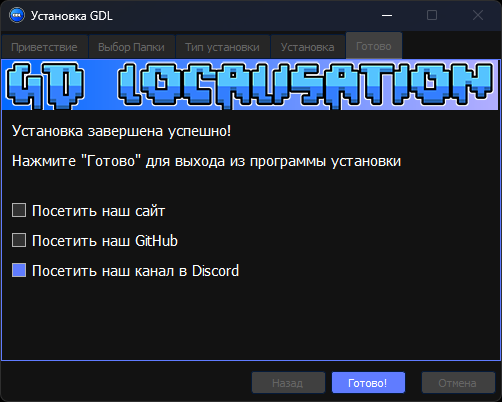

# GDL

 </a>       
Geometry Dash Localisation - модификация, которая нацелена на полный перевод игры Geometry Dash на русский, и, возможно, другие языки.

#### Полезные ссылки
- Сайт - [Ссылка](https://www.gdlocalisation.uk)
- Официальный дискорд - [Ссылка](https://discord.gg/CScsGU3N6M), [Запасная ссылка](https://discord.gg/Vh6G9G9Tk2)
- Скачать релиз (32-бит) - [Ссылка](https://github.com/gdlocalisation/gdl-installer/releases/latest/download/GDL_Installer.exe)

## Репозитории
- [GDL Site](https://github.com/gdlocalisation/gdl-site)
- [GDL Installer](https://github.com/gdlocalisation/gdl-installer)
- [GDL Binaries](https://github.com/gdlocalisation/gdl-binaries)
- [GDL Assets](https://github.com/gdlocalisation/gdl-assets)
- [GDL Source code](https://github.com/gdlocalisation/gdl-source-code)

## Команда GDL
Наша команда состоит из 10 человек, которым я хочу выразить свою благодарность :) Без вас ничего бы не получилось!
- [__@jaan2897__](https://github.com/JaanDev) - основатель проекта, программист, а также создатель сайта, перерисовщик текстур.
- [__@myemilia__](https://github.com/mye-creator) - переводчик игры, переводчик руководства по редактору, создатель и владелец [YouTube канала](https://www.youtube.com/channel/UC7oKo9NgkRz39AAz-6Gb78A).
- [__@demisans__](https://github.com/DemiSans) - переводчик игровых текстов, редактора.
- [__@kolyah35__](https://github.com/Kolyah35) - программист GDL и помощник Jaan-а.
- [__@lilray7703__](https://youtube.com/channel/UCK2ADfizaRFJzhei_Qubumg) - перерисовщик текстур.
- [__@pixelsuft__](https://github.com/Pixelsuft) - создатель установщика.
- [__@rnmnx__](https://www.youtube.com/c/%D0%A3%D0%B1%D0%B5%D0%B9%D0%A7%D0%B8%D1%82%D0%B5%D1%80%D0%BE%D0%B2%D0%9E%D1%80%D0%B8%D0%B3%D0%B8%D0%BD%D0%B0%D0%BB) - программист.
- [__@astrajl___](https://www.youtube.com/channel/UCtC8U-f3iRtm601DcfoUEhg) - перерисовщик текстур.
- [__@maximaldash__](https://www.youtube.com/channel/UCb92kWSQ-5NWIcTZnxHKAfg) - перерисовщик текстур, дизайнер шрифтов.
- [__@raelc__](https://github.com/NotRaelc) - помощник с установщиком и переводчик игры.

Отдельное спасибо нескольким людям - [__HJfod__](https://github.com/HJfod), [__Mat__](https://github.com/matcool/), [__QuasarKim__](https://github.com/Quasar-Kim   ), [__sleepyut__](https://discord.com/channels/@me/1201258270455779440).

## Установка 
#### Windows (7, 8, 8.1, 10, 11):
1. Скачайте [установщик](https://github.com/gdlocalisation/gdl-installer/releases/latest/download/GDL_Installer.exe) из последнего релиза. 
2. Откройте файл .exe (Нужно немного подождать, он берёт информацию с сервера) и начните установку.  
3. Нажмите далее и выберите путь (Если не выбрался автоматически), где установлена Geometry Dash (Допустим E:/Games/gd).  
4. Выберите, какой способ установки DLL вам нужен (Мне нужен этот способ установки, так как у меня нет никаких модов).  
5. Нажмите установить и ждите установку.  
6. Если все установилось успешно, то поздравляю, теперь у вас гд на русском языке.  

#### Поддержка на других системах
- MacOS ❌
- Linux ⚠️
- Android ❌
- Windows ✔️

## Системные требования
1. Системные требования Geometry Dash.
2. Желательно SSD.

## Известные баги
1. Не работает анинсталлер (подождите, пока мы его не загрузим на сервер).
2. Не выделяются некоторые пути в выборе типа установки (исправлено?). Скоро будет фикс.

Свои пожелания пишите на дискорд сервер GDL или [__raelc__](https://discord.com/channels/@me/1201263222460796959) в дискорде.

## Todo
1. Фикс всех багов ⚠️
2. Доделать все текстуры ❌
3. Доделать сайт ✔️
4. Перевести весь текст в игре ❌
5. Поддержка андроид ❌
6. Трейлер для канала ✔️

# 2.2!!!
 <u>__Всвязи с выходом Geometry Dash 2.2, мод частично перестал быть актуальным. Мы сейчас занимаемся переводом строк и фиксом оставшихся багов. Мы сообщим, когда допилим мод.__ </u>

## Лицензия
Лицензировано [GNU General Public License v3.0](https://github.com/gdlocalisation/gdl-installer/blob/main/LICENSE.md).
